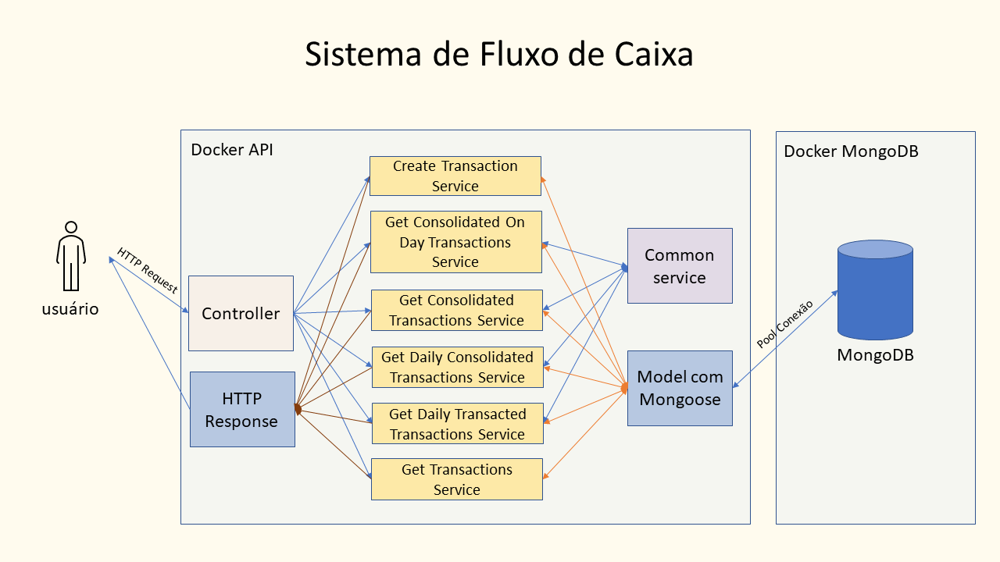

# Sistema de Fluxo de Caixa

Este projeto consiste em desenvolver uma API como parte do processo de recrutamento e avaliação para a empresa [MTTechne](www.mttechne.com.br).

## O teste

Foram passadas as seguintes intruções para arealização do test:

#### DESCRITIVO DA SOLUÇÃO

Um comerciante precisa controlar o seu fluxo de caixa diário com os lançamentos
(débitos e créditos), também precisa de um relatório que disponibilize o saldo
diário consolidado.

#### REQUISITOS DE NEGÓCIO:

- Serviço que faça o controle de lançamentos;
- Serviço do consolidado diário.

#### REQUISITOS TÉCNICOS OBRIGATÓRIOS:

- Deve ser feito no Framework NodeJS;
- Obrigatório (Design Patterns,Padrões de Arquitetura, SOLID, Clean Code e etc);
- Readme com instruções de como subir a aplicação
  local, container e utilização dos serviços. Incluir desenho da solução e explicação
  não técnica da arquitetura;
- Realizar testes unitários abrangendo o maior número de cenários possíveis;
- Hospedar em repositório público (GitHub)

  <br><br>

# Arquitetura

As principais partes da API são: Controller, Services, Repository e Presenter (HTTP Response).

- **Controller** - Implementa seis (6) rotas para os respectivos endpoint, sendo um POST e cinco GET.
- **Services** - Implementa as regras de negócio para cada rota. Recebe por inversão de dependência o repository e o presenter.
- **Repository** - Implementa as operações com o banco de dados e implementa model para cada coleção. É passado do controller para os services fazendo inversão de dependência.
- **Presenter** - É responsável para responder as requisições dos usuários. É passado do controller para os services fazendo inversão de dependência.

A imagem a seguir exemplifica a relações entre as respectivas partes do sistema.



<br>

## Containers

São unidades de software isoladas que contêm todos os elementos necessários para executar um aplicativo, incluindo o código, as dependências e as configurações. Eles fornecem um ambiente consistente e isolado, garantindo que o aplicativo funcione da mesma forma, independentemente do ambiente em que esteja sendo executado.
O proejeto é apresentado em dois containers Docker e gerenciado pelo Docker-compose:

- Container 1: Contem o MongoDB.
- Container 2: A aplicação implementada em NodeJS.

<br>

## Descrição dos EndPoints

Nos endpoint temos os conceitos de consolidated e transacted.

- **consolidated**: Apresenta resultados acumulados de toda série histórica ou até uma data fornecida.
- **transacted**: Apresenta resultados com totalizações por dia. Não leva em conta as transações dos outros dias.
  <br><br>

Insere uma nova transação.

```
POST /transaction
```

<br>
Lista todas as transações.

```
GET /transaction
```

<br>
Apresenta os totais para credit, debit e total. Resultado consolidado, ou seja, todos os três dados totalizados.

- Se for fornecido uma data o resultado será com todos os dados até a data informada.
- Se não for informada uma data, o resultado apresentará as mesmas informações com todos os dados da base.

```
GET /transaction/consolidated/until/:until?

ou

GET /transaction/consolidated/until/
```

<br>
Apresenta o credit, debit e total por data. O debit e credit são totalizações do dia e o total é o acumulado da série histórica.

- Se for fornecido uma data o resultado será com todos os dados da base até a data informada.
- Se não for informada uma data o resultado será com todos os dados da base.

```
GET /transaction/consolidated/daily/until/:until?

ou

GET /transaction/consolidated/daily/until/
```

<br>
Apresenta a totalização por dia do credit, debit e total. A totalização não considera as transações dos outros dias.

- Se for informado uma data o resultado será com todos os dados da base até a data informada.
- Se não for informado uma data o resultado será com todos os dados da base.

```
GET /transaction/transacted/daily/until/:until?

ou

GET /transaction/transacted/daily/until/
```

<br>
Apresenta a totalização do credit, debit e total, exclusivamente para o dia informado.

```
GET /transaction/transacted/on-day/:day?
```

<br><br>

# Tecnologias utilizadas

## Qualidade de Código

- **prettier**: Ferramenta de formatação de código que ajuda a manter a consistência e a legibilidade do código-fonte.
- **eslint**: Ferramenta de análise estática de código para JavaScript. Ela ajuda a identificar problemas e erros comuns no código, além de aplicar regras de estilo e boas práticas de programação.
- **husky**: Ferramenta para automatizar ganchos (hooks) do Git no Node.js. Ele permite que você defina scripts personalizados para serem executados em momentos específicos.
  - Neste projeto, antes do commit, está sendo checado:
    - O lint para o arquivos que estão em stage.
    - E roda todos os testes.
- **lint-stageg**: Permite executar linters de código apenas nos arquivos modificados em um determinado commit.
- **winston**: Biblioteca de registro (logging) para o Node.js. Ela fornece uma interface flexível e extensível para registrar mensagens e eventos em seus aplicativos Node.js.

## Regra de negocio

- **decimal.js**: Biblioteca JavaScript que oferece suporte a operações matemáticas precisas e manipulação de números decimais. Ela foi projetada para superar as limitações de aritmética de ponto flutuante do JavaScript padrão, que pode resultar em imprecisões em cálculos envolvendo números decimais.
- **node-input-validator**: Biblioteca para validação de entrada de dados em aplicativos Node.js. Ela fornece uma maneira simples e flexível de validar e sanitizar dados.

## Outras tecnologias

- **Express**: Framework para desenvolvimento de aplicações web em Node.js. Ele fornece uma camada de abstração sobre o servidor HTTP do Node.js.
- **MongoDB**: Banco de dados orientado a documentos, classificado como um banco de dados NoSQL (não relacional). Ele foi projetado para armazenar e gerenciar grandes volumes de dados de forma eficiente, fornecendo alta escalabilidade e desempenho.
- **Mongoose**: Biblioteca de modelagem de objetos do MongoDB para aplicativos Node.js. Ela fornece uma camada de abstração sobre o driver nativo do MongoDB, facilitando a interação com o banco de dados e a definição de esquemas de dados.
- **Docker-compose**: Ferramenta que permite definir e gerenciar vários contêineres Docker como uma única aplicação. Com ele, você pode criar, configurar e executar aplicativos multi-container.
- **NodeJS**: Ambiente de tempo de execução de código aberto baseado no motor JavaScript V8 do Google Chrome. Ele permite que você execute JavaScript no lado do servidor.
- **NPM**: Node Package Manager é o gerenciador de pacotes padrão para o ecossistema do Node.js. Ele permite que os desenvolvedores instalem, gerenciem e compartilhem pacotes de código reutilizáveis ​​(módulos) para seus projetos.
- **Jest**: Framework de teste de código aberto para JavaScript, projetado principalmente para testar aplicativos e bibliotecas do Node.js

# Instalação

Passo 1: Clone o projeto. Na sua pasta de projetos execute o seguinte comando.

```
git clone https://github.com/martinmoraes/sfc.git
```

Passo 2: Instale as dependências. Na pasta raiz do projeto, execute o seguinte comando.

```
npm install
```

## Execução em modo de produção

Iniciar a aplicação. É necessário ter instalado o Docker e Docker-compose. Na pasta raiz do projeto execute o seguinte comando.

```
docker-compose up -d
```

## Execução em modo desenvolvimento

Passo 1: MongoDB em Docker - Para executar o MongoDB em um Docker, execute o seguinte comando:

```
docker run -d --rm --name mongodb \
	-p 27017:27017 \
	-v data:/data/db \
	-e MONGO_INITDB_ROOT_USERNAME=admin \
	-e MONGO_INITDB_ROOT_PASSWORD=admin \
	mongo:6.0.6
```

Passo 2: Rodar o projeto - Certifique-se de estar na pasta raiz do projeto e execute o seguinte comando.

```
npm run start:dev
```

## Postman: Testar os endpoint

Pode ser utilizado o aplicativo [Postman](https://www.postman.com/) para fazer requisições nos endpoints.
Na raiz do projeto, na pasta "postman" tem os arquivos que podem ser importados no Postman. Importe o environment e collection.

<br>

# Testes

Os testes de unidade são uma prática de desenvolvimento de software em que unidades individuais de código são testadas para verificar se funcionam conforme o esperado.

- Para rodar todos os teste, certifique-se de estar na pasta raiz do projeto e execute o seguin comando:

```
npm run test
```

- Para verificar a cobertura de teste, execute o seguinte comando:

```
npm run test:coverage
```

# Formatação

- Lint: Executa o ESLint. ESLint irá analisar os arquivos JavaScript, identificar problemas de código conforme as regras configuradas (no arquivo .eslintrc ou .eslintrc.json), e realizar correções automáticas sempre que possível. Isso pode incluir ajustes de formatação, remoção de espaços em branco, adição de ponto-e-vírgula, entre outros.
  Estando na raiz do projeto execute o seguinte comando:

```
npm run lint:fix
```

- Prettier: Uma ferramenta de formatação de código. Formata os arquivos JavaScript (com extensão .js) no diretório 'src' e em todos dentro dele. Esse comando formata os arquivos JavaScript presentes no diretório 'src' e em seus subdiretórios usando as regras definidas no arquivo .prettierrc. Ele reescreve os arquivos com as alterações de formatação aplicadas diretamente no local.
  Estando na raiz do projeto execute o seguinte comando:

```
npm run format
```
